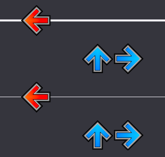
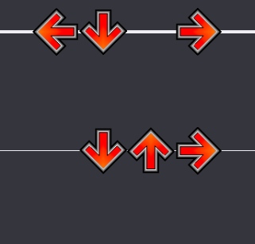
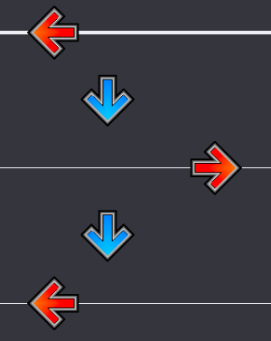
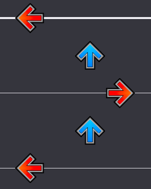
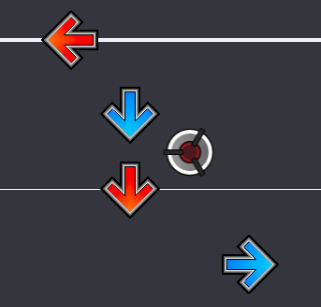
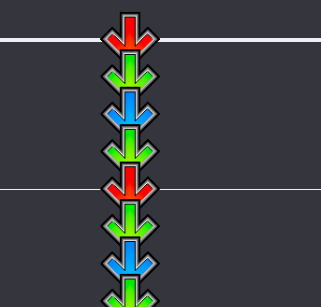

# Notation

Charters ofter put acronyms for the techs used in their charts. There are many different kinds, so this page is used to list as many as possible.

## `+`,`-` — Tech quantity
A minus or plus after a tech notation (BR-, XO+) indicates that this tech appears in the chart more or less prominently. 

A notation without any symbol means that the chart has the tech in it, a minus that it only appears a few times, and a plus that it appears a lot, or is particularly difficult.

Sometimes, a charter may put ++ or even ! to indicate an extreme use of the tech.

## BR — Bracket
Using one feet to hit two arrows at once.

|Brackets, blue notes are hit with one foot|"Hands"|
|:-:|:-:|
|||

## XO — Crossover
Using one feet to hit a note on the other side of the pad, eg. hitting the right arrow with the left foot, the left arrow with the right foot.

Can be distinguished in two categories : crossovers, where the crossing feet goes over the other, and crossunders, where where the crossing feet goes behind the other (see below)

Also sometimes called twists, especially in Pump It Up.

|Crossover|Crossunder|
|:-:|:-:|
|||

## FS — Footswitch
Alternating steps on the same arrow. Often times there will be a mine to indicate a footswitch, though some may omit it.

|Classic Footswitch|び|
|:-:|:-:|
|||
## BXF — Bracket, Footswitch and Crossover
As Brackets, Footswitches and Crossovers are the most common types of tech used in charts, they are sometimes combined together in one notation.

`+` and `-` are often put after a letter to indicate [quantity](#---tech-quantity). Depending the the charter, it may also be done using a lowercase letter instead of a `-`.

## SS — Sideswitch
Footswitches but specifically on the left and right arrow, necessitating a twist to execute properly. 

## DS — Doublestep
## JA, JH — Jack
## XMOD — No CMOD
## FL — Flams
## BU — Burst
## RH, SKT — Rhythm
## STR — Streams
## BT — Bracket Tap
## JU, SJ, TJ — Jump
## DR — Drill
## AN, SC — Afronova
## HS — Holdstream
(handstream?)
## RS — Roundstep
## DT — 
## SH — 
## MV — 
## ST — 
## TR — Trick
## FX — Effects
## MD, MA, M* — Mines
## CT — Center step (?)
